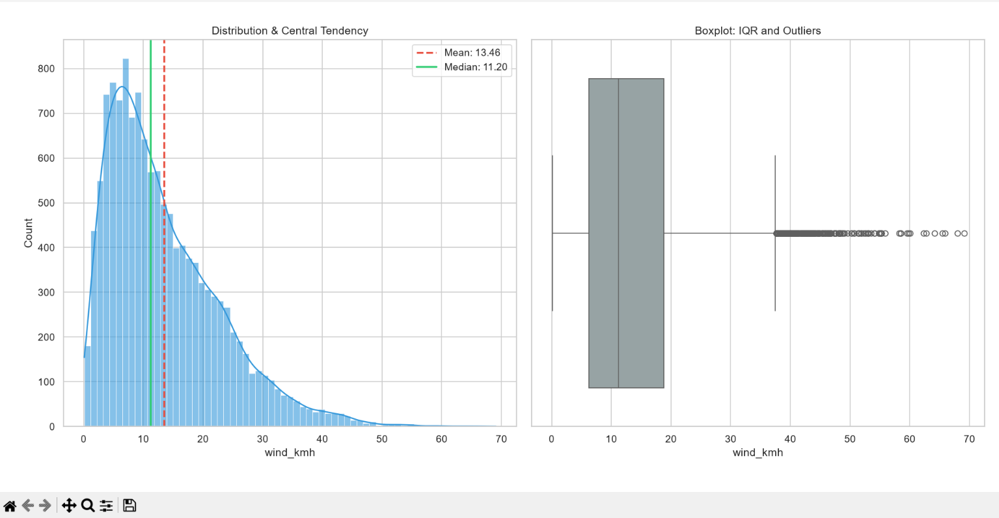

## Statistical Analysis: Wind Speed

This section outlines the descriptive statistics calculated for the `wind_kmh` feature from the `weather.csv` dataset.

### Metrics & Mathematical Definitions

* **Mean**: The arithmetic average of the dataset. Sensitive to extreme outliers.  
  $\displaystyle \bar{x} = \frac{1}{n}\sum_{i=1}^{n}x_i$

* **Median**: The middle value of the sorted dataset. A robust estimator of the center.  
  $\displaystyle \tilde{x} = x_{\frac{n+1}{2}}$

* **Sample Variance**: The average squared deviation from the mean, utilizing Bessel's correction ($n - 1$) for unbiased sample estimation.  
  $\displaystyle s^2 = \frac{1}{n-1}\sum_{i=1}^{n}(x_i - \bar{x})^2$

* **Standard Deviation (SD)**: The square root of the variance, expressing dispersion in the original units ($\text{km/h}$).  
  $\displaystyle s = \sqrt{s^2}$

* **Range**: The absolute difference between the maximum and minimum observations.  
  $\displaystyle R = \max(x) - \min(x)$

* **Interquartile Range (IQR)**: The spread of the central 50% of the data. It is a robust measure of variability, unaffected by outlier gusts.  
  $\displaystyle \text{IQR} = Q_3 - Q_1$

---

### Visualization

